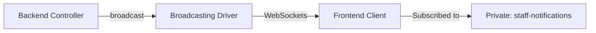

# Realtime Notifications Integration Guide

This guide explains how your frontend client connects to the backend to receive realtime notifications when a new **Announcement** or **Campaign** is created.

---

## 1. How Laravel Broadcasting Works
When an event (like `AnnouncementCreated`) is triggered on the backend:
1. The backend pushes the event payload to a **Broadcasting Driver** (e.g., Laravel Reverb, Pusher, or Soketi).
2. The Broadcasting Driver publishes the message to the **`staff-notifications`** private channel.
3. The frontend (subscribed to the channel via **Laravel Echo**) receives the event payload instantly.



---

## 2. Prerequisites (Broadcasting Driver)
To enable WebSockets, you need to configure a broadcasting connection in your `.env`. 

### Option A: Laravel Reverb (Recommended for Laravel 11+)
To use Laravel's official WebSocket server, run:
```bash
php artisan install:broadcasting --reverb
```
This automatically updates your `.env` with:
```env
BROADCAST_CONNECTION=reverb
REVERB_APP_ID=...
REVERB_APP_KEY=...
REVERB_APP_SECRET=...
REVERB_HOST="127.0.0.1"
REVERB_PORT=8080
REVERB_SCHEME=http
```

---

## 3. Frontend Setup

### Step 1: Install Laravel Echo and Pusher-JS
Install the official Javascript libraries to handle WebSocket connections:
```bash
npm install --save-dev laravel-echo pusher-js
```

### Step 2: Configure Laravel Echo with JWT Authentication
Because `staff-notifications` is a **private channel**, Laravel Echo must authenticate the user before allowing them to subscribe. Since your API uses JWT, pass the JWT token in the authentication headers.

```javascript
import Echo from 'laravel-echo';
import Pusher from 'pusher-js';

window.Pusher = Pusher;

// Get the user's JWT token from localStorage or cookie
const jwtToken = localStorage.getItem('token'); 

window.Echo = new Echo({
    broadcaster: 'reverb', // or 'pusher' depending on your driver
    key: import.meta.env.VITE_REVERB_APP_KEY,
    wsHost: import.meta.env.VITE_REVERB_HOST,
    wsPort: import.meta.env.VITE_REVERB_PORT ?? 80,
    wssPort: import.meta.env.VITE_REVERB_PORT ?? 443,
    forceTLS: (import.meta.env.VITE_REVERB_SCHEME ?? 'https') === 'https',
    enabledTransports: ['ws', 'wss'],
    
    // Auth configuration for Private Channels using JWT
    authEndpoint: 'http://api-web.cdp.lk/api/broadcasting/auth',
    auth: {
        headers: {
            Authorization: `Bearer ${jwtToken}`,
            Accept: 'application/json',
        }
    }
});
```

---

## 4. Subscribing and Listening for Events

Once Laravel Echo is configured, subscribe to the `staff-notifications` channel and listen for `AnnouncementCreated` and `CampaignCreated` events.

### Listening Script

```javascript
// Subscribe to the private channel
window.Echo.private('staff-notifications')
    
    // Listen for new Announcements
    .listen('.App.Events.AnnouncementCreated', (data) => {
        console.log('New Announcement Received:', data);
        showVisualNotification(
            'New Announcement: ' + data.title, 
            data.content
        );
    })
    
    // Listen for new Campaigns
    .listen('.App.Events.CampaignCreated', (data) => {
        console.log('New Campaign Received:', data);
        showVisualNotification(
            'New Campaign: ' + data.title, 
            data.description
        );
    });

// Function to trigger a browser/UI notification
function showVisualNotification(title, message) {
    if (Notification.permission === 'granted') {
        new Notification(title, { body: message });
    } else {
        // Fallback to UI toast message
        alert(`${title}\n${message}`);
    }
}
```

> [!NOTE]
> By default, Laravel prefixes event names with their namespace. Adding a dot `.` prefix (like `.App.Events.AnnouncementCreated`) ensures Laravel Echo listens for the exact event class path returned by the server.
